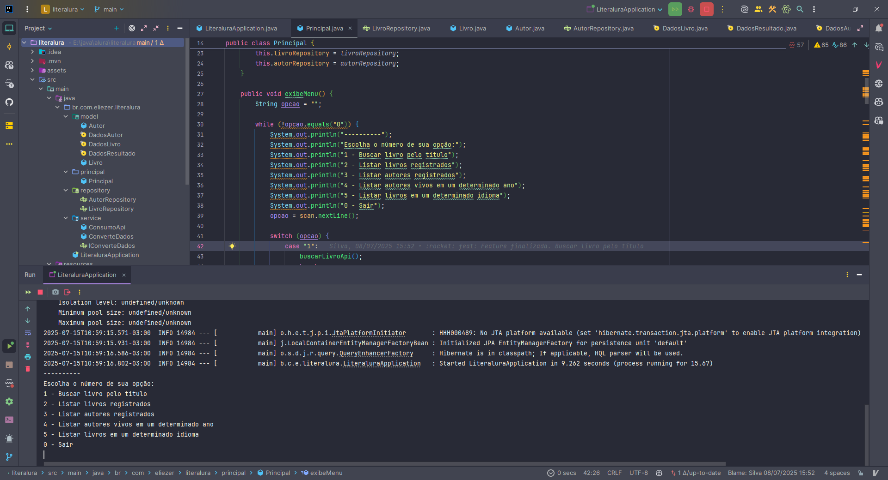
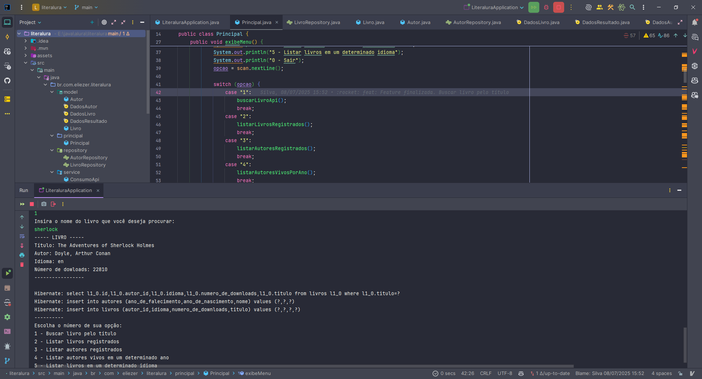
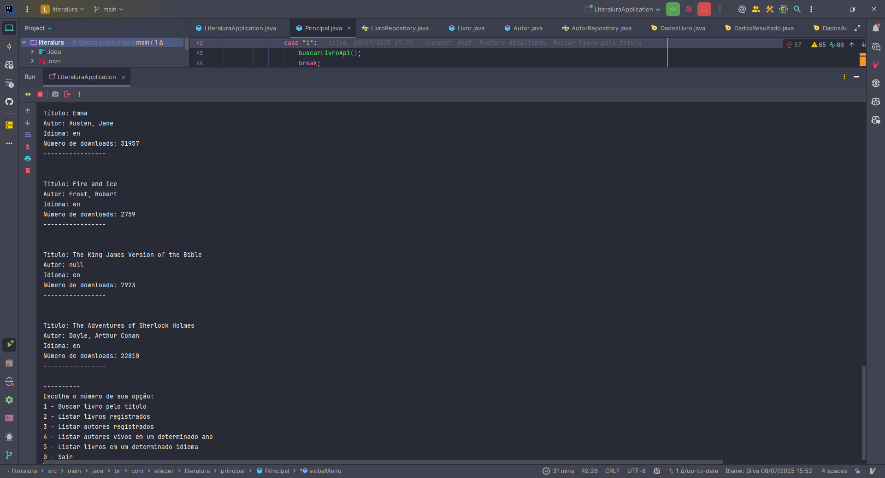
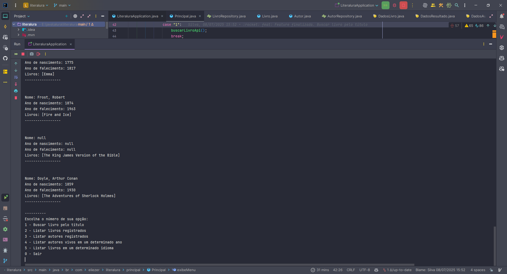
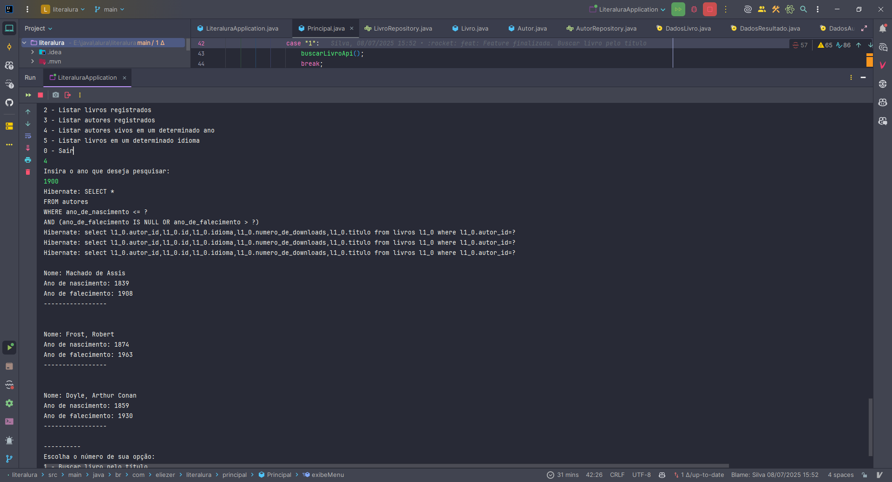
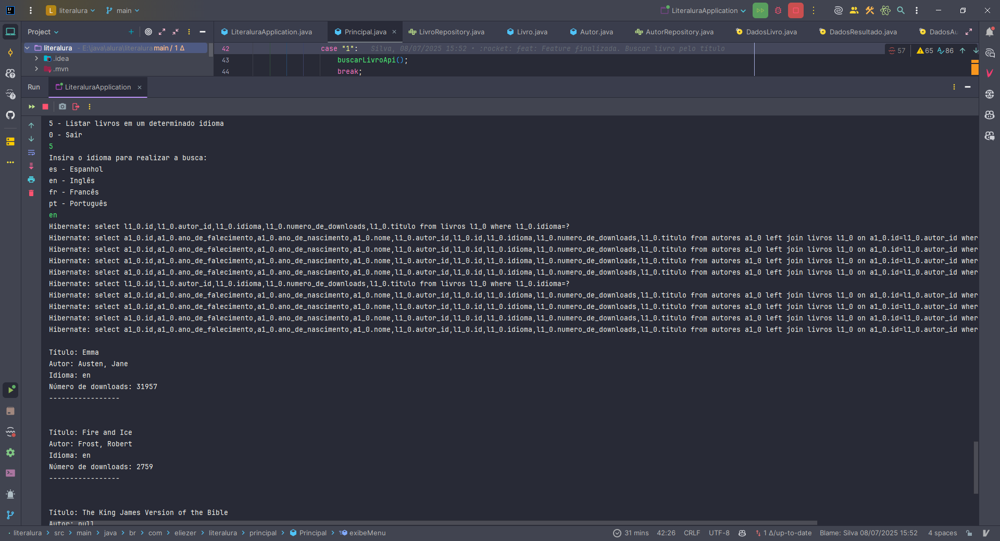
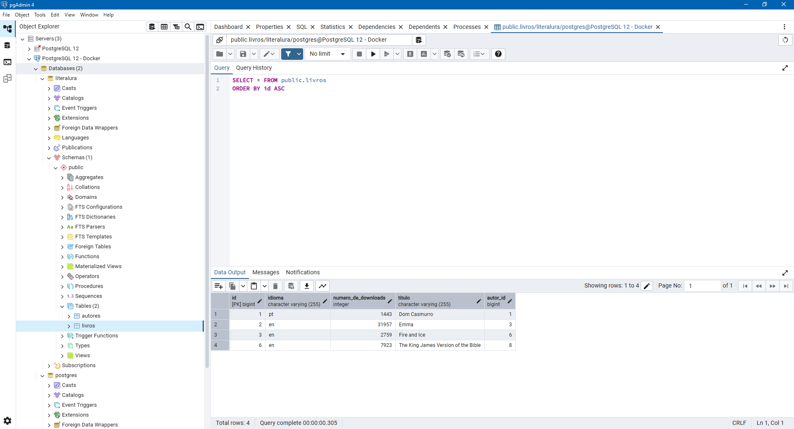
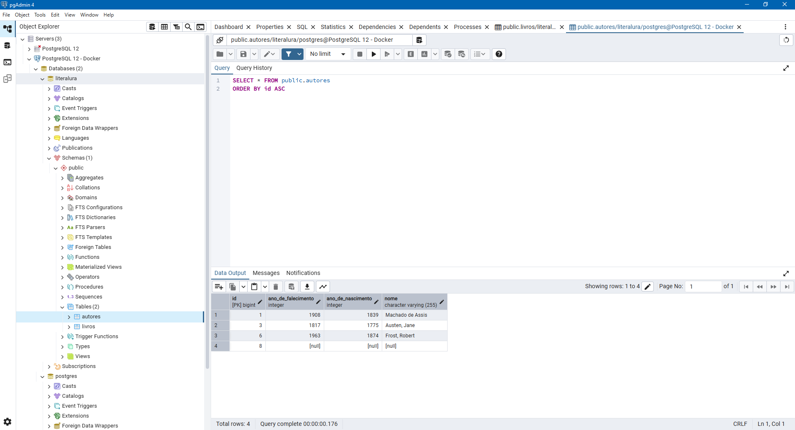
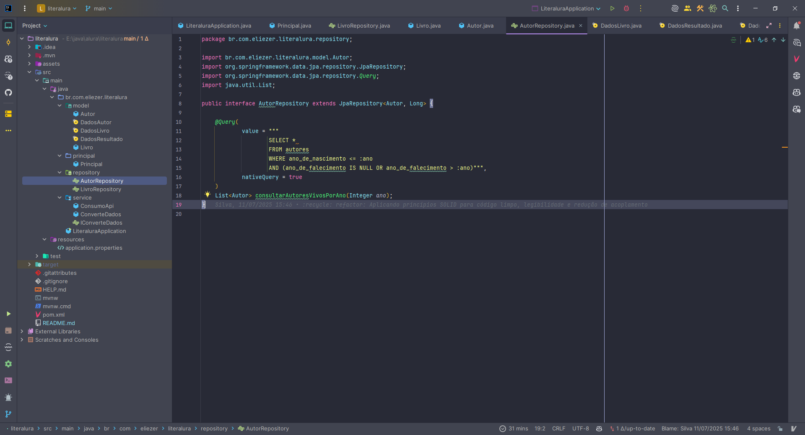
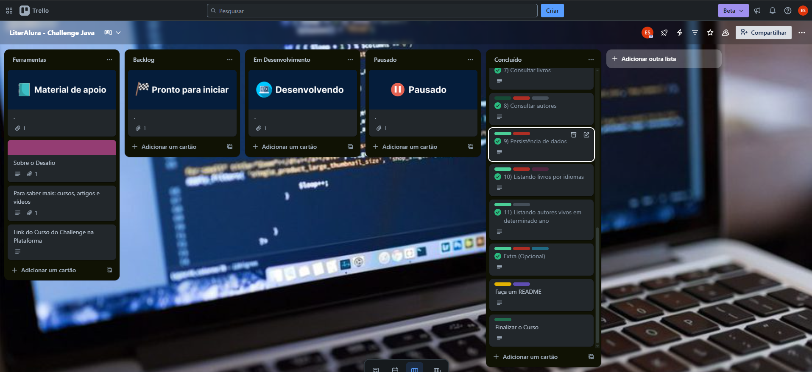

# 📚 Literalura

Aplicação Java Spring Boot que consome a [API Gutendex](https://gutendex.com/) de livros gratuitos e registra os dados em um banco de dados PostgreSQL.

---

## 🚀 Funcionalidades

O programa roda via terminal com o seguinte menu:

```java
System.out.println("Escolha o número de sua opção:");
System.out.println("1 - Buscar livro pelo título");
System.out.println("2 - Listar livros registrados");
System.out.println("3 - Listar autores registrados");
System.out.println("4 - Listar autores vivos em um determinado ano");
System.out.println("5 - Listar livros em um determinado idioma");
System.out.println("0 - Sair");
```

---

## 🧪 Exemplos de uso

| Opção | Descrição | Fonte de dados |
|-------|-----------|----------------|
| `1` | Busca um livro pelo título e salva no banco | API Gutendex |
| `2` | Lista todos os livros já registrados | Banco PostgreSQL |
| `3` | Lista todos os autores salvos | Banco PostgreSQL |
| `4` | Lista autores vivos em determinado ano | Banco PostgreSQL |
| `5` | Lista livros de um idioma específico | Banco PostgreSQL |

---

## 🧰 Tecnologias utilizadas

- Java 21
- Spring Boot 3
- Spring Data JPA
- Maven
- PostgreSQL
- Jackson (desserialização JSON via DTOs)
- Docker
- DBeaver / PgAdmin

---

## 🧠 O que aprendi com esse projeto

- Consumo de APIs REST com `RestTemplate`
- Mapeamento de dados usando **DTOs com Jackson**
- Manipulação com **Java Streams**
- Consultas usando:
  - **Derived Queries** com Spring Data JPA
  - **@Query(nativeQuery = true)** para SQL customizado
- Integração com banco de dados PostgreSQL (local e via Docker)
- Uso de ferramentas visuais como PgAdmin e DBeaver

---

## 🐳 Como executar com Docker (PostgreSQL)

```bash
docker run --name literalura-db \
  -e POSTGRES_DB=literalura \
  -e POSTGRES_USER=admin \
  -e POSTGRES_PASSWORD=admin \
  -p 5432:5432 \
  -d postgres
```

#### Configure o arquivo `application.properties`:

```properties
spring.datasource.url=jdbc:postgresql://localhost:5432/literalura
spring.datasource.username=admin
spring.datasource.password=admin
spring.jpa.hibernate.ddl-auto=update
spring.jpa.show-sql=true
```

#### Rode a aplicação:

```bash
./mvnw spring-boot:run
```

---

## 💻 Como executar localmente (sem Docker)

1. Instale o PostgreSQL: [https://www.postgresql.org/download/](https://www.postgresql.org/download/)
2. Crie o banco de dados:

```sql
CREATE DATABASE literalura;
CREATE USER admin WITH PASSWORD 'admin';
GRANT ALL PRIVILEGES ON DATABASE literalura TO admin;
```

3. Use o mesmo `application.properties` acima.
4. Rode a aplicação com:

```bash
./mvnw spring-boot:run
```

---

## 🗂️ Estrutura do projeto

```text
📁 model
 ┣ 📄 Autor, Livro
 ┣ 📄 DadosAutor, DadosLivro, DadosResultado (DTOs para desserializar JSON)

📁 repository
 ┣ 📄 AutorRepository, LivroRepository (com queries personalizadas)

📁 service
 ┣ 📄 ConsumoApi (request na API Gutendex)
 ┣ 📄 ConverteDados (transforma JSON → entidade)
 ┣ 📄 IConverteDados (interface funcional)

📁 principal
 ┣ 📄 Principal (classe de entrada com o menu)

📄 LiteraluraApplication (classe main)
📄 application.properties
```

> 📷 Sugestão: adicione **prints** de:
> - Terminal com o menu funcionando  
>   
> - Terminal exibindo livros buscados  
>   
> - Terminal exibindo livros registrados no banco de dados Postgres após consulta na API Gutendex 
>   
> - Terminal exibindo autores registrados no banco de dados Postgres após consulta na API Gutendex 
>   
> - Terminal exibindo consulta dos autores vivos conforme o ano
>   
> - Terminal exibindo consulta dos livros por idioma
>   
> - PgAdmin ou DBeaver com tabela `livro` e `autor` populadas  
>   
>   
> - Código com uso de `@Query(nativeQuery = true)` e streams com DTOs  
>   
> - Organização de tarefas - TRELLO
>   
---

## ✍️ Próximas melhorias

- Adicionar testes unitários com JUnit
- Exibir mais detalhes por livro (downloads, idiomas extras, etc.)
- Criar uma API REST e frontend em React
- Exportar resultados em CSV ou JSON

---

## 🧑‍💻 Autor

Desenvolvido com 💙 por [Eliezer Moraes Silva](https://www.linkedin.com/in/eliezer-moraes-silva-80b68010b/)
